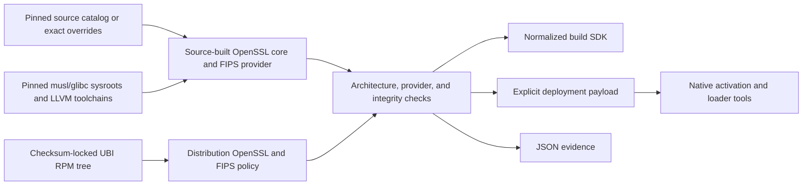
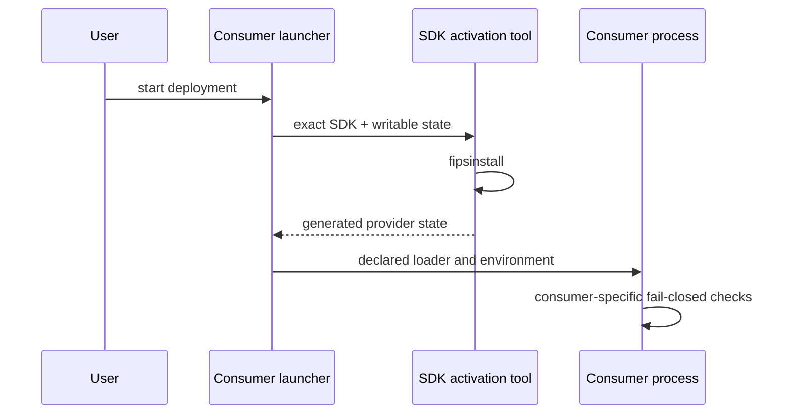

# Architecture

`rules_fips` turns immutable upstream inputs into a target-specific crypto SDK
and an evidence manifest. Starlark owns the graph. Small Go programs own
filesystem transforms, provider activation, and ELF checks that do not belong
in generated shell.



## Stages

1. The Bzlmod extension resolves catalog selections or root-module source
   overrides into integrity-pinned repositories.
2. OpenSSL core is built from the selected source as static archives.
3. The certificate-referenced source builds the loadable FIPS provider.
4. Declared validators inspect target ELF identity, hash artifacts, run
   `fipsinstall`, and load the configured provider. Arm64 provider checks use a
   pinned static QEMU user-mode emulator on AMD64 workers.
5. A normalized directory supplies headers, static libraries, OpenSSL,
   provider, configuration, the selected loader/libc, evidence, and licenses.
6. Static native tools implement provider activation and execution through the
   SDK-owned loader without invoking a shell.

The UBI profile takes a parallel input path: a pure module extension imports
only checksum-locked RPM repositories, `rpmtree` merges their declared
contents, and a Starlark action projects the exact runtime payload. It consumes
the distribution's configured provider and policy file without running
`fipsinstall`. No package manager or mutable installation script runs during
repository evaluation or an SDK action.

Supported targets are AMD64 and Arm64 with either musl 1.2.5 or a glibc 2.35
ABI baseline. Arm64 may build natively or cross-build on AMD64. Cross-built
provider checks use pinned QEMU; no native-hardware claim is implied by them.
The additive UBI 10 profile models its concrete glibc 2.39 ABI and package
policy separately; generic glibc targets never acquire a distribution
constraint.

## Linkage boundary

```text
consumer + static libcrypto.a
        │
        └── loads ossl-modules/fips.so
                         │
                         └── SDK-owned loader + libc runtime
```

The source OpenSSL build produces static `libcrypto.a` and `libssl.a`.
`fips.so` is
deliberately not folded into another binary: it is the provider module whose
identity and integrity configuration are checked at runtime. The normalized
contract therefore reports `fully_static = False` and exposes every runtime
file and environment template explicitly. A language consumer decides how to
link the static core and package the provider; rules_fips never claims that the
consumer is validated.

The UBI profile instead supplies its declared `libcrypto.so.3` and
`libssl.so.3`. Consumers select dynamic SSL linkage explicitly and package the
loader, both libraries, provider, policy configuration, and transitive runtime
closure. The two linkage profiles share the normalized SDK shape but never
silently substitute for one another.

## Startup enforcement



Source-built provider activation is an engineering mechanism, not a compliance
authority. The UBI profile has no activation command; its packaged launcher
sets the declared configuration and delegates to the exact-closure runtime
wrapper. Evidence uses `"compliance_claim": "none"`.

## Source boundary

No upstream source file is patched. Configuration uses upstream-supported
options. The repository contains no shell scripts and no repository-owned
`run_shell` action.

OpenSSL still uses its upstream Configure/make system. Starlark constructs the
argument vectors and exact environment, then runs a statically compiled driver
that starts declared Perl and Make directly. Upstream Make recipes use the
declared Bash/BusyBox toolbox. No host shell, compiler, loader, libc, or PATH
lookup is part of the action. Staging, validation, target emulation, activation,
and launch use Starlark actions or static Go helpers.

Validators and staging tools receive a closed, deterministic environment. They
do not inherit the worker's `PATH`, dynamic-loader injection variables, or
provider configuration, and copied SDK trees reject symlinks that escape their
declared source root.

The execution-configured SDK activation and runtime-launcher tools are built
from the integrity-pinned Go archive without resolving the application FIPS
toolchain. Their cache and module state are declared outputs. Go subprocesses
change working directories internally, so compiler scratch uses the
action-private temporary directory; no scratch file is read as an input or
published as an artifact. Target-configured helpers remain selected by the
application CPU and libc profile.

## Trust boundary

The graph proves far less than a regulated deployment needs. It establishes
which bytes were selected, which build controls ran, and what the provider
reported during checks. It does not establish that a consumer VM, CPU, kernel,
container, application, or operating procedure is covered by a CMVP
certificate. See [FIPS model](fips-model.md).
