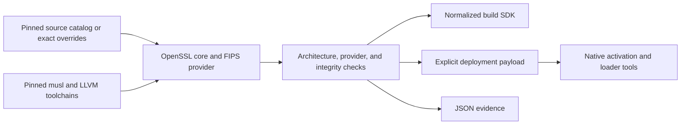
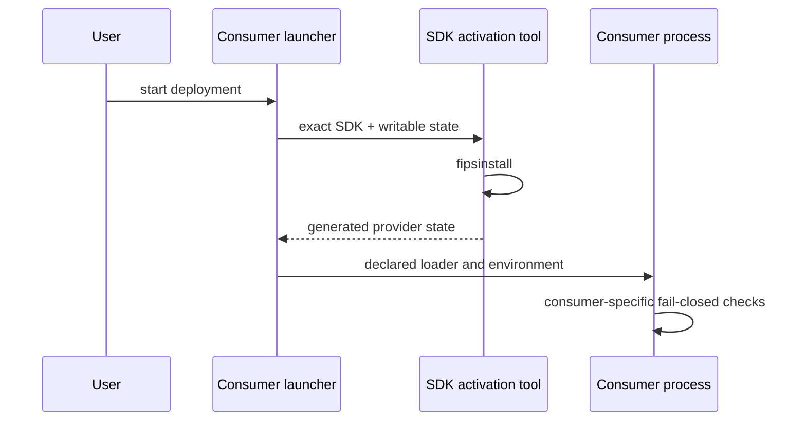

# Architecture

`rules_fips` turns immutable upstream inputs into a target-specific crypto SDK
and an evidence manifest. Starlark owns the graph. Small Go programs own
filesystem transforms, provider activation, and ELF checks that do not belong
in generated shell.



## Stages

1. The Bzlmod extension resolves catalog selections or root-module source
   overrides into integrity-pinned repositories.
2. OpenSSL core is built from the selected source as static archives.
3. The certificate-referenced source builds the loadable FIPS provider.
4. Declared validators inspect target ELF identity, hash artifacts, run
   `fipsinstall`, and load the configured provider. Arm64 provider checks use a
   pinned static QEMU user-mode emulator on AMD64 workers.
5. A normalized directory supplies headers, static libraries, OpenSSL, provider,
   configuration, musl loader/libc, evidence, and license files.
6. Static native tools implement provider activation and execution through the
   SDK-owned loader without invoking a shell.

Supported target platforms are `//fips/platforms:linux_amd64` and
`//fips/platforms:linux_arm64`. Arm64 is cross-compiled on the supported Linux
AMD64 execution platform and checked under emulation; no native-hardware claim
is implied.

## Linkage boundary

```text
consumer + static libcrypto.a
        │
        └── loads ossl-modules/fips.so
                         │
                         └── SDK-owned musl loader + libc
```

The OpenSSL build produces static `libcrypto.a` and `libssl.a`. `fips.so` is
deliberately not folded into another binary: it is the provider module whose
identity and integrity configuration are checked at runtime. The normalized
contract therefore reports `fully_static = False` and exposes every runtime
file and environment template explicitly. A language consumer decides how to
link the static core and package the provider; rules_fips never claims that the
consumer is validated.

## Startup enforcement



Activation is an engineering mechanism, not a compliance authority. Evidence
uses `"compliance_claim": "none"`.

## Source boundary

No upstream source file is patched. Configuration uses upstream-supported
options. The repository contains no shell scripts and no repository-owned
`run_shell` action.

OpenSSL still uses its upstream Configure/make system. That unavoidable
command-language boundary is delegated to `rules_foreign_cc` with declared
compilers, musl sysroots, BusyBox utilities, GNU make, Perl, and other tools.
The outer Bash process belongs to the selected Bazel execution platform.
Staging, validation, target emulation, activation, and launch use Starlark
actions or compiled Go helpers.

## Trust boundary

The graph proves far less than a regulated deployment needs. It establishes
which bytes were selected, which build controls ran, and what the provider
reported during checks. It does not establish that a consumer VM, CPU, kernel,
container, application, or operating procedure is covered by a CMVP
certificate. See [FIPS model](fips-model.md).
