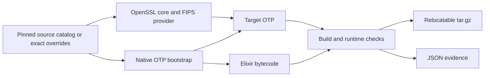
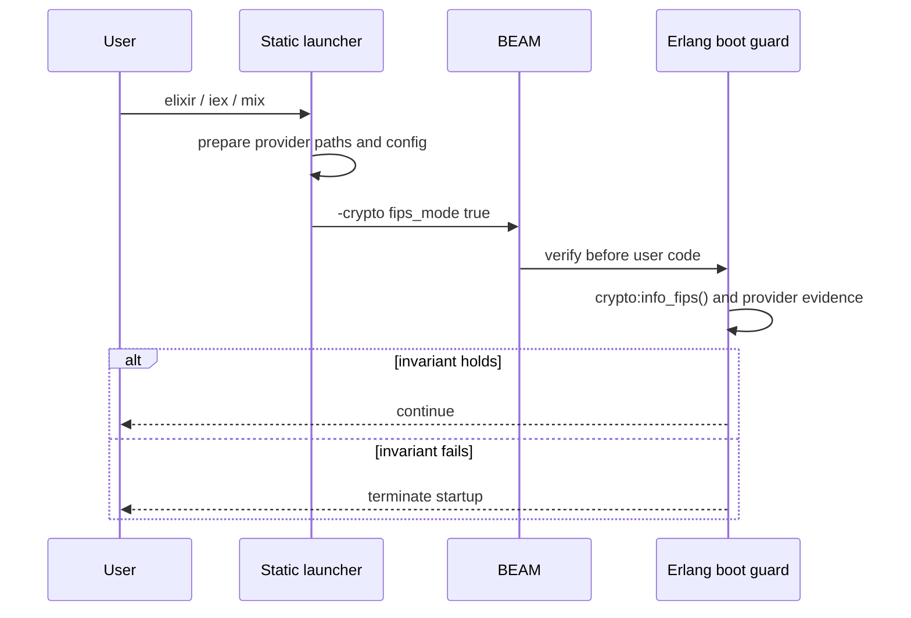

# Architecture

`rules_fips` turns immutable upstream inputs into a target-specific runtime
and an evidence manifest. Starlark owns the graph. Small Go programs own
filesystem transforms and ELF/runtime checks that do not belong in generated
shell.



## Stages

1. The Bzlmod extension resolves catalog selections or root-module source
   overrides into integrity-pinned repositories.
2. A static musl-native OTP bootstrap provides `erl`, `erlc`, and `escript`
   for the target build without borrowing an OTP installation or libc from
   the host.
3. OpenSSL core is built from the selected LTS source as static archives.
4. The certificate-referenced OpenSSL source builds the loadable FIPS provider.
5. OTP is cross-compiled with its upstream FIPS, static-NIF, static-driver,
   builtin-zlib, and builtin-zstd switches.
6. Elixir is compiled with the pinned native bootstrap and installed over the
   target OTP tree.
7. Declared validators inspect ELF identity and linkage, run provider setup,
   and start the target runtime with FIPS mode required. Arm64 checks execute
   through a pinned static QEMU user-mode emulator.
8. A deterministic packager writes the relocatable archive and evidence JSON.

Supported target platforms are `//fips/platforms:linux_amd64` and
`//fips/platforms:linux_arm64`. Arm64 is cross-compiled on the supported Linux
AMD64 execution platform and checked under emulation; no native-hardware claim
is implied.

## Linkage boundary

```text
BEAM + static crypto NIF + libcrypto.a
        │
        └── loads ossl-modules/fips.so
                         │
                         └── packaged musl loader + libc
```

The OpenSSL build produces static `libcrypto.a` and `libssl.a`; OTP's crypto
path embeds `libcrypto.a` in its statically linked crypto NIF. `fips.so` is
deliberately not folded into another binary: it is the OpenSSL provider module
whose identity and integrity configuration are checked at runtime. Packaging
the provider and musl runtime removes reliance on a deployment distribution's
OpenSSL or glibc packages while preserving that module boundary.

BEAM remaining dynamically linked to the bundled musl runtime is a consequence
of preserving that provider-loading path, not of Elixir bytecode by itself.
The static launcher invokes BEAM through the runtime-relative bundled loader.
Native OTP helpers that BEAM executes directly are linked as static musl
executables so their kernel startup does not depend on the archive's internal
`/opt/fips-elixir` ELF prefix.

## Startup enforcement



The launcher is an enforcement mechanism, not a compliance authority. Its
observations are recorded with `"compliance_claim": "none"`.

## Source boundary

No upstream source file is patched. Configuration uses upstream-supported
options. The repository contains no shell scripts and no repository-owned
`run_shell` action.

OTP, Elixir, and OpenSSL still use upstream Configure/make systems. Those
unavoidable command-language boundaries are delegated to `rules_foreign_cc`
with declared compilers, musl sysroots, BusyBox utilities, GNU make, Perl, and
other tools. The outer Bash process belongs to the selected Bazel execution
platform. Staging, validation, target emulation, launch, and packaging use
Starlark actions or compiled Go helpers.

## Trust boundary

The graph proves far less than a regulated deployment needs. It establishes
which bytes were selected, which build controls ran, and what the target
runtime reported during checks. It does not establish that a new CPU, kernel,
container, application, or operating procedure is covered by a CMVP
certificate. See [FIPS model](fips-model.md).
